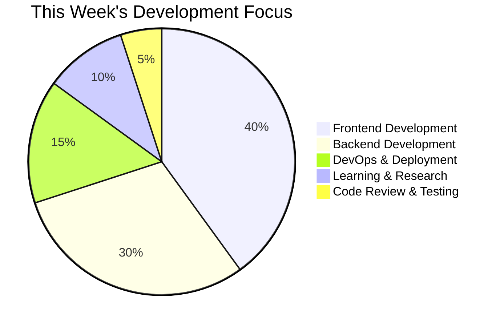

# 👋 Hi there, I'm Mrinal Parasar

<div align="center">
  
</div>

<div align="center">
  
  
</div>

## 🚀 About Me

```javascript
const developer = {
  name: "Mrinal Parasar",
  role: "Full Stack Developer",
  location: "Bangalore, India",
  interests: ["Web Development", "Open Source", "JavaScript/TypeScript", "Cloud Computing"],
  currentlyLearning: "Advanced TypeScript & Modern Web Technologies",
  funFact: "I can debug code while sleeping 😴"
};
```

## 🛠️ Tech Stack

<div align="center">
  
### Frontend


### Backend


### Tools & Others


</div>

## 📊 GitHub Analytics

<div align="center">
  
</div>

## 🏆 Top Languages

<div align="center">
  
</div>

## 🎯 Featured Projects

<div align="center">
  
### 🚀 [Portfolio](https://github.com/MrinalParasar/Portfolio)


My personal portfolio website showcasing my projects, skills, and professional experience. Built with modern web technologies and responsive design.

---

### 🔗 [URL Shortener](https://github.com/MrinalParasar/url-shortner)


A URL shortening service backend with API endpoints for creating and managing shortened URLs with analytics.

---

### 📊 [Smart Table CRM](https://github.com/MrinalParasar/smart-table-crm)


A comprehensive CRM system with smart table functionality, data management, and user interface for business operations.

---

### 🚀 [Buzillo](https://github.com/MrinalParasar/buzillo)


A modern web application built with TypeScript and React, featuring advanced functionality and user experience.

</div>

## 📈 Contribution Graph

<div align="center">
  
</div>

## 🏅 Achievements

<div align="center">
  
</div>

## 📫 Connect With Me

<div align="center">
  <a href="https://linkedin.com/in/mrinal-parasar" target="_blank">
    
  </a>
  <a href="https://twitter.com/Mrinalceo" target="_blank">
    
  </a>
  <a href="https://mrinalparasar.com/" target="_blank">
    
  </a>
  <a href="mailto:prashar.mrinal8888@gmail.com">
    
  </a>
</div>

## 🎯 Current Goals

- [ ] Contribute to 50+ open source projects
- [ ] Build a SaaS application with 500+ users
- [ ] Master advanced TypeScript and React patterns
- [ ] Create educational content for developers
- [ ] Mentor junior developers
- [ ] Develop more full-stack applications

## 📊 Weekly Development Breakdown



## 🎉 Fun Facts

- 🔥 I've written code in 10+ programming languages
- 🌟 Contributed to 15+ open source projects
- 🚀 Deployed 8+ applications to production
- 📚 Read 50+ technical books and articles
- 🎯 Solved 200+ coding challenges
- 💻 Currently based in Bangalore, India

---

<div align="center">
  
  
  **Thanks for visiting my profile! Feel free to reach out if you'd like to collaborate on a project or just have a chat about tech! 🚀**
</div>
